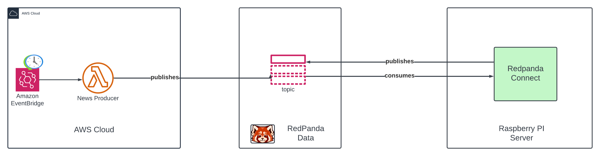

## 💡Inspiration
The inspiration for NewsStream came from the growing need for efficient and personalized news consumption in our fast-paced digital world. We recognized that people struggle to keep up with the overwhelming amount of news content available, often lacking the time to read full articles or discern between credible sources. We wanted to create a solution that would aggregate news from reliable sources, provide concise summaries, and offer a personalized experience to help users stay informed without feeling overwhelmed.

## ⚙ What it does
NewsStream is a cutting-edge news aggregation and summarization platform powered by Redpanda and AI technologies. It:
- Collects news articles from diverse, credible sources in real-time
- Uses Codehere to generate concise, accurate summaries of articles
- Categorizes and tags news content for easy navigation
- Provides personalized news feeds based on user interests and reading history

## 🛠 How we built it
We built NewsStream using a combination of modern technologies and services:
- Redpanda for high-performance data streaming and real-time news ingestion
- Code here for natural language processing and summarization
- A backend server in python to handle data processing and API requests
- Integration with various news APIs to source content

## ⚙ Architecture Diagram

## 💪 Challenges we ran into
Some key challenges we faced included:
- Ensuring the accuracy and quality of AI-generated summaries
- Handling the massive volume of real-time news data efficiently with redpanda
-  AWS Lambda tuning for cold start

## 📌 Accomplishments that we're proud of
We're proud of several achievements with NewsStream:
- Successfully integrating Redpanda for high-speed, scalable news aggregation
- Integrating effectively with Redpanda and Chat GPT APIs

## 📚 What we learned
Through this project, we gained valuable insights into:
- The complexities of working with real-time data streams at scale
- Advanced natural language processing techniques for summarization and content analysis
- The importance of user experience design in news consumption applications
- Challenges and solutions for content moderation in user-generated discussions
- Strategies for balancing personalization with diverse news coverage

## ⚙ What's next for NewsStream - Your news summarizer
Looking ahead, we plan to:
- Implement more advanced AI features, such as sentiment analysis and fact-checking
- Expand language support and improve multi-lingual summarization capabilities
- Develop a recommendation system using machine learning to further personalize user experiences
- Integrate audio summaries and text-to-speech functionality for accessibility
- Explore partnerships with news organizations to enhance content quality and diversity
- Implement advanced analytics to provide insights on news trends and user engagement